# Beszel Mobile

A cross-platform mobile client for [Beszel](https://github.com/henrygd/beszel), the lightweight server monitoring platform. Built with Flutter for native performance on Android, iOS, and desktop.

[](https://flutter.dev)
[](LICENSE)

## Overview

Beszel Mobile provides real-time visibility into your server infrastructure through an intuitive mobile interface. The app connects to your self-hosted Beszel instance via PocketBase, delivering live metrics, alerts, and container status directly to your device.

### Key Capabilities

- Real-time system metrics via WebSocket subscriptions
- Fleet-wide health monitoring dashboard
- Per-system detailed analytics with historical charts
- Docker container monitoring and status tracking
- Alert management with threshold configuration
- Offline data caching for intermittent connectivity

## System Requirements

| Platform | Minimum Version |
|----------|-----------------|
| Android | API 21 (5.0 Lollipop) |
| iOS | 12.0 |
| macOS | 10.14 Mojave |
| Windows | 10 (1903) |
| Linux | Ubuntu 18.04 / equivalent |

**Backend:** Beszel server instance (any recent version)

## Screenshots

<p align="center">
  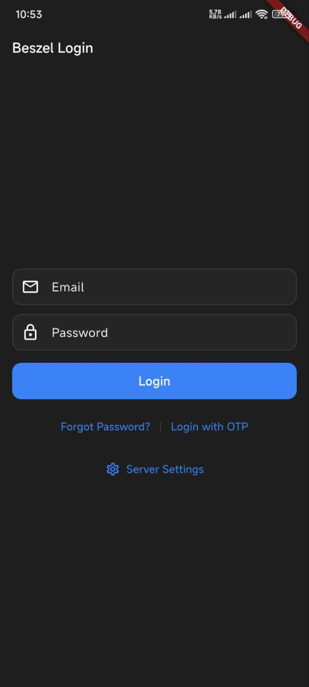
  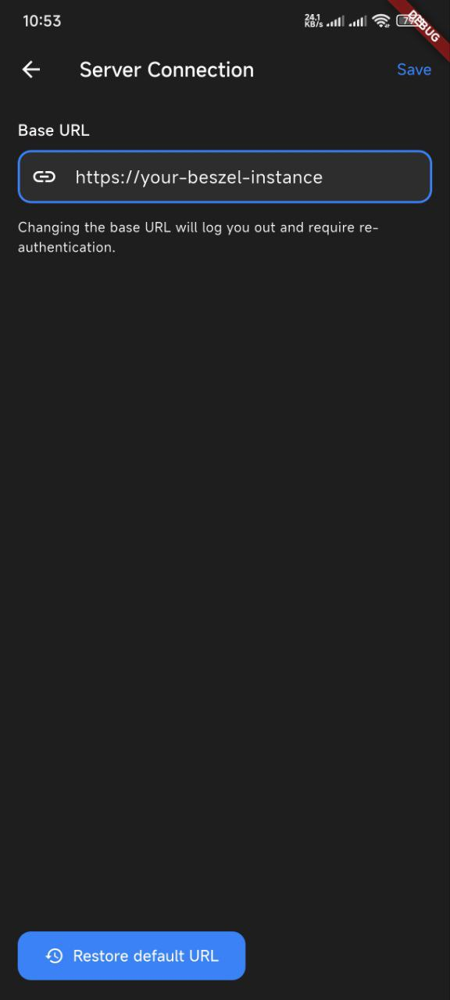
  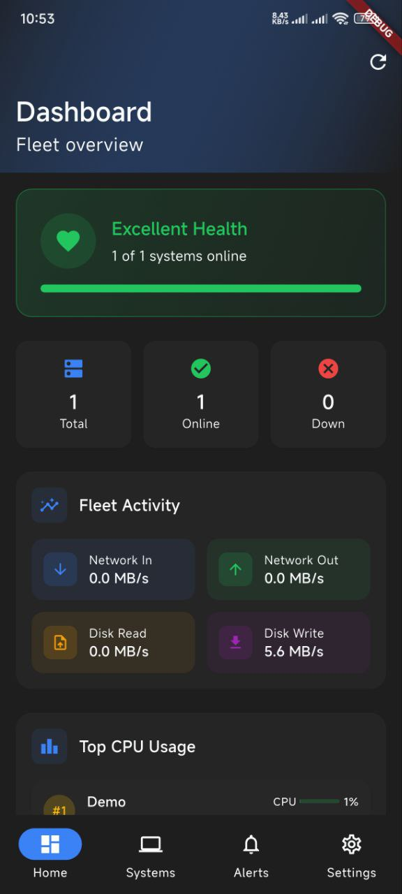
  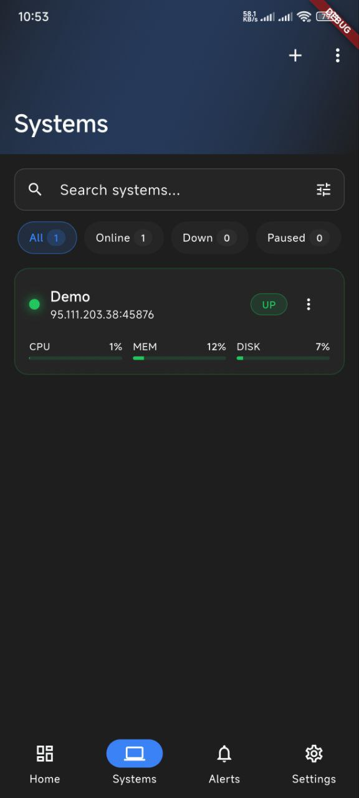
</p>

<p align="center">
  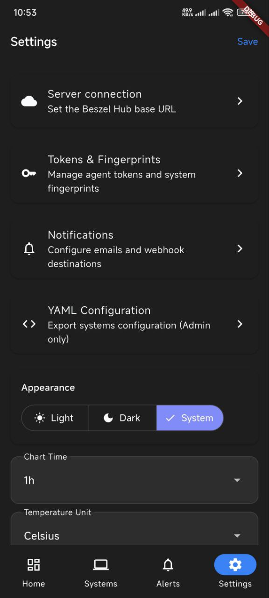
  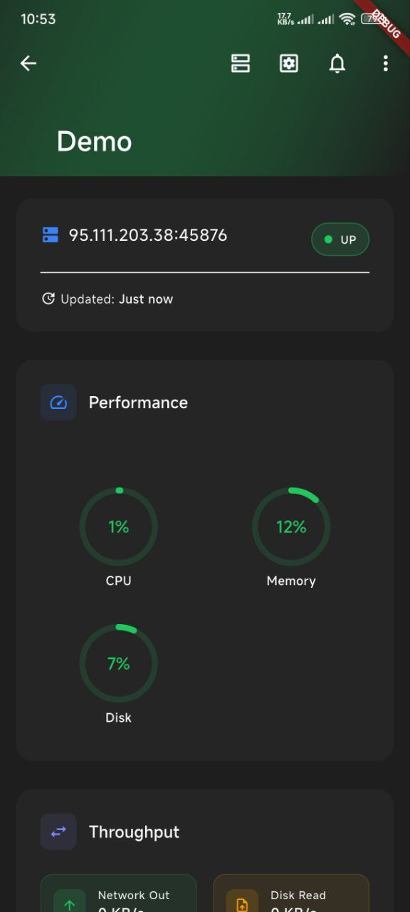
  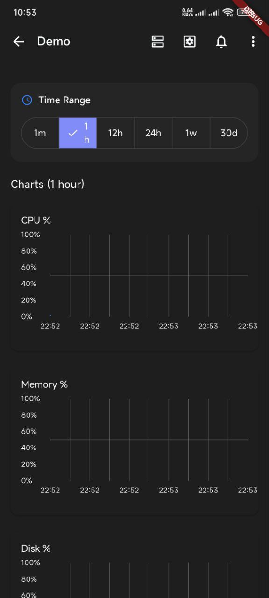
  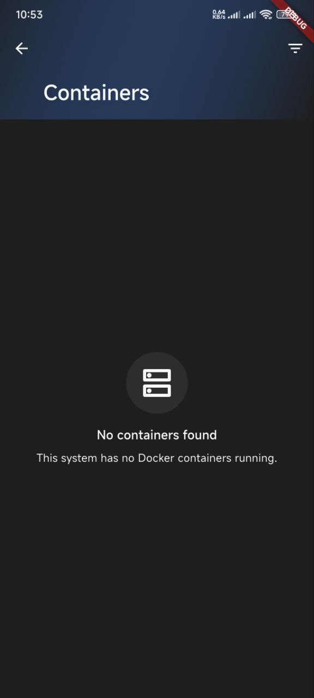
</p>

<p align="center">
  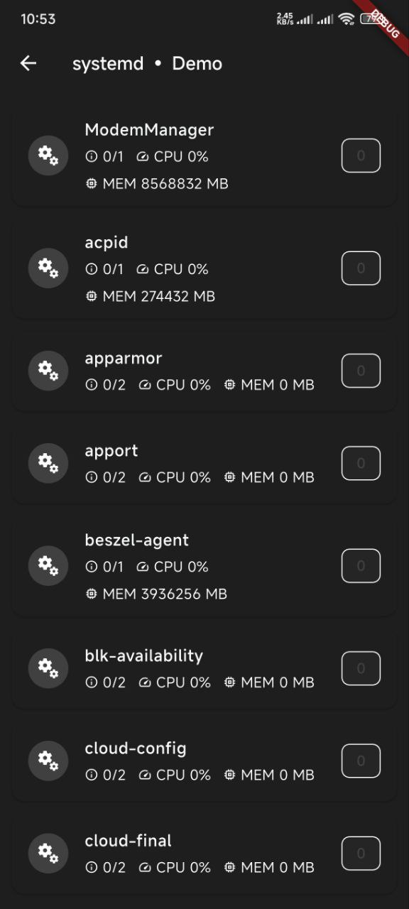
  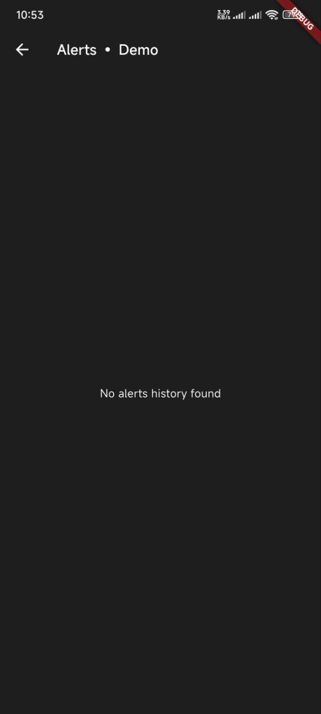
  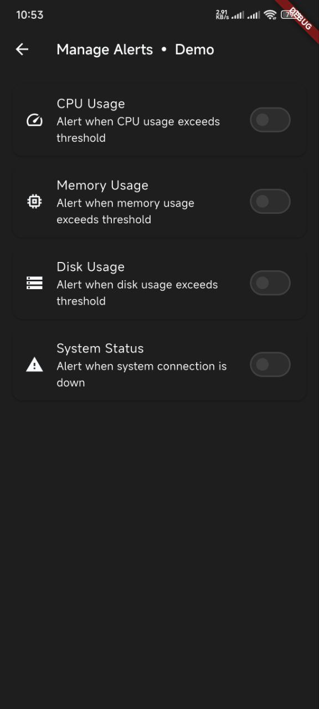
  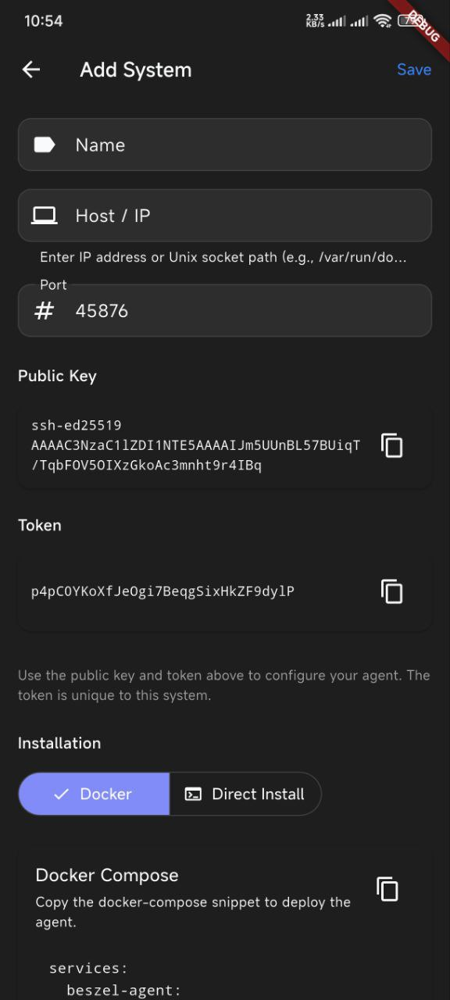
</p>

## Application Screens

### Dashboard
The home screen provides fleet-wide visibility with a health indicator showing the percentage of online systems, summary statistics (total, online, down, paused), aggregated network and disk I/O metrics, top CPU consumers, and active alerts requiring attention.

### Systems List
Displays all monitored systems with real-time status. Features include search and filtering by status, sorting by name/status/CPU/memory/disk, inline metric bars for quick assessment, and visual indicators for systems with active alerts.

### System Details
Deep-dive view for individual systems showing circular gauge visualizations for CPU, memory, disk, and swap usage, network throughput (in/out) and disk I/O rates, environment data (load average, temperatures, battery), and interactive time-series charts with configurable ranges (1 minute to 30 days).

### Containers
Docker container monitoring per system with container status (running, stopped, health state), per-container resource usage, and search and status filtering.

### Alerts
Alert management interface showing active alerts across the fleet, alert history and resolution tracking, and per-system alert configuration.

### Settings
Application configuration including server connection management, theme selection (light, dark, system), and notification preferences.

## Architecture

### High-Level Design

```
┌─────────────────────────────────────────────────────────────────────────┐
│                           Beszel Mobile App                              │
├─────────────────────────────────────────────────────────────────────────┤
│  Presentation Layer                                                      │
│  ┌─────────────┐ ┌─────────────┐ ┌─────────────┐ ┌─────────────┐       │
│  │  Dashboard  │ │   Systems   │ │   Details   │ │ Containers  │       │
│  └──────┬──────┘ └──────┬──────┘ └──────┬──────┘ └──────┬──────┘       │
│         │               │               │               │               │
│  ┌──────┴───────────────┴───────────────┴───────────────┴──────┐       │
│  │                    Widget Components                         │       │
│  │  AnimatedCard │ MetricGauge │ SkeletonLoader │ SystemCharts │       │
│  └──────────────────────────────┬───────────────────────────────┘       │
├─────────────────────────────────┼───────────────────────────────────────┤
│  Service Layer                  │                                        │
│  ┌──────────────────────────────┴───────────────────────────────┐       │
│  │ SystemsService │ AlertsService │ ContainersService │ AuthService│    │
│  └──────────────────────────────┬───────────────────────────────┘       │
├─────────────────────────────────┼───────────────────────────────────────┤
│  Data Layer                     │                                        │
│  ┌──────────────────────────────┴───────────────────────────────┐       │
│  │              PocketBase Client (REST + WebSocket)             │       │
│  └──────────────────────────────┬───────────────────────────────┘       │
└─────────────────────────────────┼───────────────────────────────────────┘
                                  │
                                  ▼
                    ┌─────────────────────────┐
                    │     Beszel Server       │
                    │  (PocketBase Backend)   │
                    └─────────────────────────┘
```

### Data Flow

```
┌──────────────┐     HTTP/REST      ┌──────────────┐
│              │ ─────────────────► │              │
│    Mobile    │                    │    Beszel    │
│     App      │ ◄───────────────── │    Server    │
│              │     WebSocket      │              │
└──────────────┘   (Real-time)      └──────────────┘

1. Initial Load
   App ──[GET /api/collections/systems/records]──► Server
   App ◄──[JSON: System list with current stats]── Server

2. Real-time Updates
   App ──[Subscribe: systems/*]──► Server
   App ◄──[Stream: Record changes]── Server (continuous)

3. Historical Data
   App ──[GET /api/collections/system_stats/records?filter=...]──► Server
   App ◄──[JSON: Time-series data for charts]── Server
```

### State Management

The application uses a service-based architecture with reactive streams:

```
┌─────────────────────────────────────────────────────────────┐
│                        UI Layer                              │
│  StreamBuilder<List<SystemRecord>>                          │
│       │                                                      │
│       ▼                                                      │
│  ┌─────────────────────────────────────────────────────┐    │
│  │              SystemsService                          │    │
│  │  ┌─────────────┐    ┌─────────────────────────┐     │    │
│  │  │   Stream    │◄───│  StreamController       │     │    │
│  │  │  (output)   │    │  (broadcast)            │     │    │
│  │  └─────────────┘    └───────────┬─────────────┘     │    │
│  │                                 │                    │    │
│  │  ┌─────────────────────────────┴─────────────┐     │    │
│  │  │         PocketBase Subscription           │     │    │
│  │  │  pb.collection('systems').subscribe(...)  │     │    │
│  │  └───────────────────────────────────────────┘     │    │
│  └─────────────────────────────────────────────────────┘    │
└─────────────────────────────────────────────────────────────┘
```

### Project Structure

```
lib/
├── api/
│   └── pb_client.dart              # PocketBase client singleton
│
├── animations/
│   ├── app_curves.dart             # Easing curve definitions
│   ├── app_durations.dart          # Animation timing constants
│   ├── dialog_transitions.dart     # Modal/dialog animations
│   ├── page_transitions.dart       # Screen navigation transitions
│   └── staggered_animation_mixin.dart  # List item stagger effect
│
├── models/
│   ├── system_record.dart          # System data model
│   └── user_settings.dart          # User preferences model
│
├── navigation/
│   └── animated_navigation_bar.dart    # Bottom navigation with animations
│
├── screens/
│   ├── home_overview_screen.dart   # Dashboard
│   ├── systems_screen.dart         # Systems list
│   ├── system_details_screen.dart  # Individual system view
│   ├── containers_screen.dart      # Container list per system
│   ├── container_details_screen.dart
│   ├── alerts_screen.dart          # Alert history
│   ├── manage_alerts_screen.dart   # Alert configuration
│   ├── login_screen.dart           # Authentication
│   ├── settings_screen.dart        # App settings
│   └── ...
│
├── services/
│   ├── auth_service.dart           # Authentication logic
│   ├── systems_service.dart        # System data + subscriptions
│   ├── system_stats_service.dart   # Historical metrics
│   ├── alerts_service.dart         # Alert management
│   ├── containers_service.dart     # Container data
│   └── settings_service.dart       # User preferences persistence
│
├── theme/
│   ├── app_colors.dart             # Color palette (light/dark)
│   ├── app_spacing.dart            # Spacing scale
│   ├── app_radius.dart             # Border radius tokens
│   ├── app_typography.dart         # Text styles
│   └── theme_controller.dart       # Theme state management
│
├── widgets/
│   ├── animated_card.dart          # Tap-feedback card
│   ├── animated_metric_gauge.dart  # Animated progress indicator
│   ├── skeleton_loader.dart        # Loading placeholder
│   ├── empty_state.dart            # Empty content placeholder
│   ├── loading_state.dart          # Loading/error wrapper
│   └── system_charts.dart          # Time-series chart components
│
└── main.dart                       # Application entry point
```

### Design System

The application implements a token-based design system for visual consistency:

**Spacing Scale**
```
xs: 4dp   sm: 8dp   md: 12dp   lg: 16dp   xl: 24dp   xxl: 32dp
```

**Border Radius**
```
small: 8dp   medium: 12dp   large: 16dp   extraLarge: 24dp
```

**Animation Durations**
```
instant: 100ms   fast: 150ms   normal: 200ms   medium: 300ms   slow: 400ms   chart: 600ms
```

**Status Colors**
```
success: #22C55E (green)    warning: #F59E0B (amber)
error: #EF4444 (red)        inactive: #9CA3AF (gray)
```

### Component Hierarchy

```
App
├── MaterialApp
│   └── ThemeController (InheritedWidget)
│       └── Navigator
│           ├── LoginScreen
│           └── HomeShell (authenticated)
│               ├── AnimatedNavigationBar
│               └── IndexedStack
│                   ├── HomeOverviewScreen
│                   │   ├── HealthBar
│                   │   ├── SummaryGrid
│                   │   ├── FleetInsights
│                   │   ├── TopSystemsSection
│                   │   └── ActiveAlertsSection
│                   ├── SystemsScreen
│                   │   ├── SearchBar
│                   │   ├── FilterChips
│                   │   └── SystemCard (list)
│                   ├── AlertsScreen
│                   └── SettingsScreen
```

## User Flow

```
                                    ┌─────────────┐
                                    │   Launch    │
                                    └──────┬──────┘
                                           │
                                           ▼
                              ┌────────────────────────┐
                              │  Check Authentication  │
                              └───────────┬────────────┘
                                          │
                         ┌────────────────┴────────────────┐
                         │                                 │
                         ▼                                 ▼
                  ┌─────────────┐                  ┌─────────────┐
                  │ Login Screen│                  │  Dashboard  │
                  └──────┬──────┘                  └──────┬──────┘
                         │                                │
                         │ credentials                    │
                         ▼                                │
                  ┌─────────────┐                         │
                  │  Validate   │                         │
                  └──────┬──────┘                         │
                         │                                │
                         └────────────────────────────────┤
                                                          │
                    ┌─────────────────────────────────────┼─────────────────────────────────────┐
                    │                                     │                                     │
                    ▼                                     ▼                                     ▼
             ┌─────────────┐                       ┌─────────────┐                       ┌─────────────┐
             │   Systems   │                       │   Alerts    │                       │  Settings   │
             └──────┬──────┘                       └─────────────┘                       └─────────────┘
                    │
                    │ select system
                    ▼
             ┌─────────────┐
             │   Details   │
             └──────┬──────┘
                    │
       ┌────────────┼────────────┐
       │            │            │
       ▼            ▼            ▼
┌───────────┐ ┌───────────┐ ┌───────────┐
│Containers │ │  systemd  │ │  S.M.A.R.T│
└───────────┘ └───────────┘ └───────────┘
```

## Build Instructions

### Development Setup

```bash
# Clone repository
git clone https://github.com/springmusk026/beszel-mobile.git
cd beszel-mobile

# Install dependencies
flutter pub get

# Verify setup
flutter doctor

# Run in debug mode
flutter run
```

### Production Builds

**Android APK**
```bash
flutter build apk --release
# Output: build/app/outputs/flutter-apk/app-release.apk
```

**Android App Bundle (Play Store)**
```bash
flutter build appbundle --release
# Output: build/app/outputs/bundle/release/app-release.aab
```

**iOS**
```bash
flutter build ios --release
# Open Xcode for archive and distribution
open ios/Runner.xcworkspace
```

**Web**
```bash
flutter build web --release
# Output: build/web/
```

**Desktop**
```bash
flutter build macos --release
flutter build windows --release
flutter build linux --release
```

## Configuration

On first launch, configure the connection to your Beszel server:

| Field | Description | Example |
|-------|-------------|---------|
| Server URL | Full URL to Beszel instance | `https://beszel.example.com` |
| Email | Account email | `admin@example.com` |
| Password | Account password | `********` |

The app stores authentication tokens securely using platform-specific secure storage.

## Dependencies

| Package | Purpose |
|---------|---------|
| `pocketbase` | Backend communication and real-time subscriptions |
| `fl_chart` | Time-series chart rendering |
| `shared_preferences` | Local settings persistence |

## Contributing

See [CONTRIBUTING.md](CONTRIBUTING.md) for development guidelines and contribution process.

## License

MIT License. See [LICENSE](LICENSE) for details.

## Related

- [Beszel](https://github.com/henrygd/beszel) - Server monitoring backend
- [PocketBase](https://pocketbase.io) - Backend framework used by Beszel
