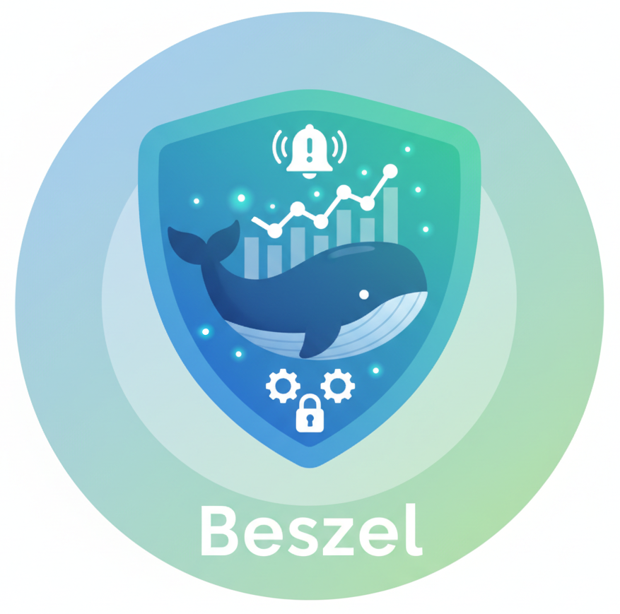

<p align="center">
  
</p>

<h1 align="center">Beszel Mobile</h1>

<p align="center">
  <strong>A lightweight, real-time server monitoring companion for <a href="https://github.com/henrygd/beszel">Beszel</a></strong>
</p>

<p align="center">
  <a href="https://flutter.dev"></a>
  <a href="https://dart.dev"></a>
  <a href="LICENSE"></a>
</p>

<p align="center">
  <a href="#features">Features</a> •
  <a href="#screenshots">Screenshots</a> •
  <a href="#installation">Installation</a> •
  <a href="#building">Building</a> •
  <a href="#architecture">Architecture</a> •
  <a href="#contributing">Contributing</a>
</p>

---

## Overview

Beszel Mobile is a cross-platform Flutter application that provides real-time monitoring of your server infrastructure through the [Beszel](https://github.com/henrygd/beszel) backend. Monitor CPU, memory, disk usage, network throughput, and Docker containers—all from your mobile device.

## Features

- **Real-time Monitoring** — Live updates via WebSocket subscriptions
- **Fleet Dashboard** — At-a-glance health status of your entire infrastructure
- **System Details** — Deep dive into individual server metrics with historical charts
- **Container Management** — Monitor Docker containers with CPU, memory, and network stats
- **Alert System** — View and manage active alerts across your fleet
- **Dark/Light Theme** — Adaptive theming with smooth transitions
- **Offline Support** — Cached data for offline viewing
- **Cross-Platform** — Android, iOS, Web, macOS, Windows, Linux

## Screenshots

<!-- Add your screenshots here -->
<!-- 
<p align="center">
  
  
  
  
</p>
-->

## Installation

### Prerequisites

- [Flutter SDK](https://docs.flutter.dev/get-started/install) 3.19+
- A running [Beszel](https://github.com/henrygd/beszel) instance

### Quick Start

```bash
# Clone the repository
git clone https://github.com/springmusk026/beszel-mobile.git
cd beszel-mobile

# Install dependencies
flutter pub get

# Run the app
flutter run
```

## Building

### Android

```bash
flutter build apk --release
# Output: build/app/outputs/flutter-apk/app-release.apk
```

### iOS

```bash
flutter build ios --release
# Then archive via Xcode
```

### Web

```bash
flutter build web --release
# Output: build/web/
```

## Architecture

```
lib/
├── api/                    # API client (PocketBase)
├── animations/             # Animation utilities & transitions
│   ├── app_curves.dart
│   ├── app_durations.dart
│   ├── dialog_transitions.dart
│   ├── page_transitions.dart
│   └── staggered_animation_mixin.dart
├── models/                 # Data models
├── navigation/             # Navigation components
├── screens/                # UI screens
│   ├── home_overview_screen.dart
│   ├── systems_screen.dart
│   ├── system_details_screen.dart
│   ├── containers_screen.dart
│   └── ...
├── services/               # Business logic & data services
├── theme/                  # Design system tokens
│   ├── app_colors.dart
│   ├── app_radius.dart
│   ├── app_spacing.dart
│   └── app_typography.dart
├── widgets/                # Reusable UI components
└── main.dart
```

### Design System

The app implements a comprehensive design system with:

| Token | Purpose |
|-------|---------|
| `AppColors` | Semantic color palette with light/dark variants |
| `AppSpacing` | Consistent spacing scale (4, 8, 12, 16, 24, 32) |
| `AppRadius` | Border radius tokens (8, 12, 16, 24) |
| `AppDurations` | Animation timing (100ms - 600ms) |
| `AppCurves` | Easing curves for smooth animations |

### Key Technologies

- **Flutter** — Cross-platform UI framework
- **PocketBase SDK** — Backend communication & real-time subscriptions
- **fl_chart** — Beautiful, animated charts
- **SharedPreferences** — Local settings persistence

## Configuration

On first launch, enter your Beszel server URL and credentials:

```
Server URL: https://your-beszel-instance.com
Email: your@email.com
Password: ********
```

## Contributing

Contributions are welcome! Please read our contributing guidelines before submitting PRs.

1. Fork the repository
2. Create your feature branch (`git checkout -b feature/amazing-feature`)
3. Commit your changes (`git commit -m 'Add amazing feature'`)
4. Push to the branch (`git push origin feature/amazing-feature`)
5. Open a Pull Request

## Related Projects

- [Beszel](https://github.com/henrygd/beszel) — The server monitoring backend
- [Beszel Agent](https://github.com/henrygd/beszel) — Lightweight agent for collecting metrics

## License

This project is licensed under the MIT License — see the [LICENSE](LICENSE) file for details.

---

<p align="center">
  Made with ❤️ by <a href="https://github.com/springmusk026">springmusk026</a>
</p>
